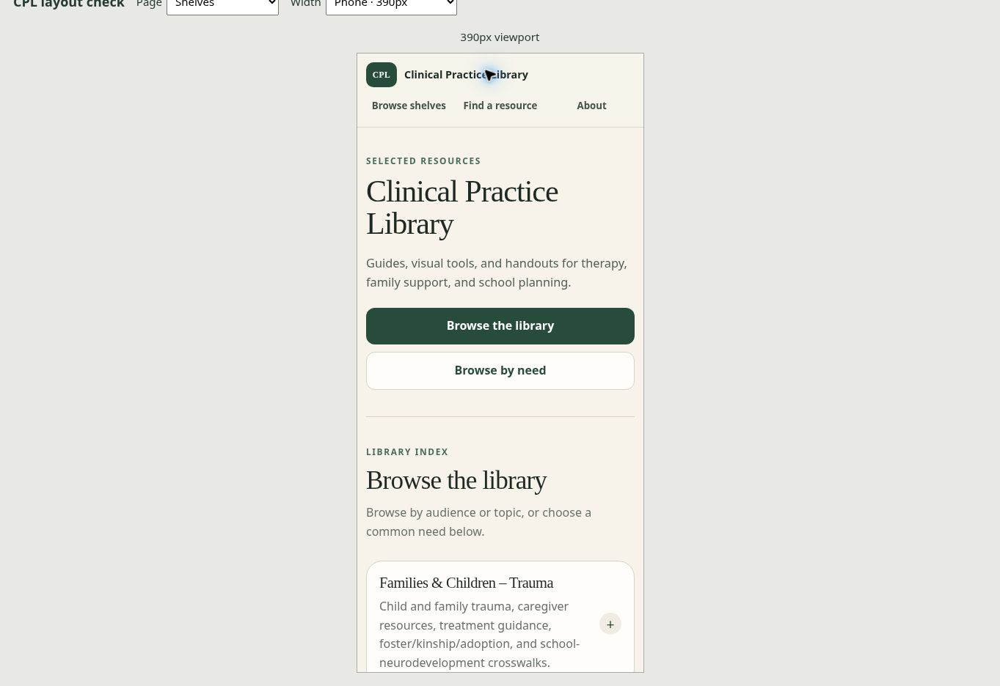

# September 30, 2026 — homepage and phone-layout handoff

## Result

The public homepage now introduces the library with: “Guides, visual tools, and handouts for therapy, family support, and school planning.” The two main actions are “Browse the library” and “Browse by need.” The folder and nested-menu number prefixes have been removed from the stable shelves and editorial preview. Meaningful numbers, including IEP/504 and resource counts, remain.

The layout fault was a three-column shelf-summary grid left behind after the number element was removed. Shelf text occupied the old 70px desktop / 42px phone number column. The summary now has two columns: flexible text and the disclosure control. Expanded shelf content no longer retains the old number-column indentation.

## Layout changes

- Phone headers show all three navigation links with targets at least 44px high.
- Phone titles, section spacing, and full-width hero buttons fit narrow screens.
- Shelf titles can use the available width; nested school and Spanish menus wrap cleanly.
- Anchor spacing keeps section introductions below the sticky header.
- Editorial-preview outer sections no longer double their horizontal padding on phones.
- Reduced-motion preferences disable smooth scrolling; decorative disclosure symbols are hidden from assistive technology.
- Resource-type labels use “Worksheet” and “Practice worksheet · use with a clinician.”

## Verification

The live production site was checked in a same-origin viewport iframe. These checks verify CSS layout at each width; they do not emulate a particular phone operating system or touch hardware.

| Main homepage viewport | Document scroll width | Result |
| --- | ---: | --- |
| 320px | 305px | No horizontal overflow; header links visible |
| 390px | 375px | No horizontal overflow; header links visible |
| 768px | 753px | No horizontal overflow; shelf headings have usable width |
| 1280px | 1265px | No horizontal overflow; desktop shelf layout restored |

The 15px difference is the browser scrollbar. At 320px, actual disclosure interactions opened School → Barrier → Support → Plain Language and Español → Educación para pacientes y familias → Neurodesarrollo y función ejecutiva. Both expanded lists fit the viewport without overflowing links or headings. The school list exposes all eight family-guide links.

The editorial preview was visually checked at 390px and 320px; the 390px geometry check found no horizontal overflow. On the main homepage, the browse action reaches a visible section introduction below the sticky header, and Enter opens a shelf disclosure.

Static HTML checks passed for internal destinations, fragment targets, unique IDs, and number-prefix removal: 258 links on the main root, 277 on its editorial preview, 270 on the colorful root, 277 on its editorial preview, and 22 on the colorful concept page. All five deployed production HTML/CSS files matched the reviewed local source byte for byte. Git whitespace checks passed. The existing school parity self-test passed all eight guides, 292 support pairings, and nine deliberately invalid cases. No GitHub Actions runs were created for these source commits; deployment readiness was verified directly.

The maintainer page at `/preview/layout-check.html` offers root/editorial/toolkit selection and 320, 390, 768, and 1280px widths. It is not linked from the public browsing navigation.

## Branches and deployment

Shared homepage and editorial fixes are deployed on `main` and `cpl-2-colorful-helpful`. Source commits are `7ab7a63095bc853a279833a9bbbb2f1ed568fdf3` (production) and `e003df2f2669be2867408266d1dd7c958471e47c` (colorful). Both source deployments are READY.

The colorful concept retains its own design. Its intro is shorter, decorative task numbers are removed, formerly inert clinical-topic and browse controls link to real destinations, and phone styles adjust its header, spacing, and choice board. After authorized sign-in, its authenticated browser review is complete at 320, 390, 768, and 1280px: document widths were 305, 375, 753, and 1265px respectively, with no horizontal overflow. The two-by-two choice board was visually checked at 320px. Actual clicks on Plan treatment and Support communication opened Therapy Resource Shelves and the Communication Supports Toolkit. The colorful version remains on its separate branch.

## Completed follow-up: communication toolkit

Review completed September 30 in America/Phoenix (October 1 UTC). Following the communication route exposed a horizontal scrollbar on the toolkit at 320px. Its fixed 280px minimum card width and large heading could exceed the available content area. Both branches now use an adaptive card minimum, shrinkable cards, smaller phone headings and padding, wrapping choice chips, and a vertical intensity scale on narrow screens.

All 17 expandable visual tools are retained. The generic “Example layout” caption was removed from 17 examples on production and 16 on the colorful branch; its specific Body Clues → Needs Map caption remains. A single adaptation note appears near the introduction. The repeated footer author credit was removed, leaving one visible credit on each page. Each branch's existing tool content and design are preserved.

| Toolkit version and viewport | Open visuals | Document scroll width | Result |
| --- | ---: | ---: | --- |
| Production · 320px | 17 | 305px | No horizontal overflow; one author credit |
| Colorful · 320px | 17 | 305px | No horizontal overflow |
| Colorful · 390px | 17 | 375px | No horizontal overflow |
| Colorful · 1280px | 17 | 1265px | No horizontal overflow |

The maintainer viewport checker now includes a Communication toolkit option, allowing direct checks of this resource. Static checks confirm 17 disclosures, valid section navigation, unique IDs, and one author credit per variant; Git whitespace checks pass. Toolkit source commits are `7e70861d5031528ea21dca2d12892f663d44ccfc` on production and `5615a6e57577e96e2cdd143e85a29a081ce0be22` on the colorful branch; both source deployments are READY.

A temporary `cpl-phone-check-2026-09-30` branch contains the reviewed homepage candidate. It is a QA checkpoint, not a production or colorful release branch.

## Next authorized work

Continue the P0/P1 scope recorded in the [September 29 handoff](2026-09-29-P0-P1-HANDOFF.md): authorship/provenance consistency, remaining visual tools and matching legacy PDFs, need-based navigation, and duplicate Spanish/asset-path review. Keep Spanish validation metadata explicit and research additions separate from the capped 95-record core. P1.5 remains deferred. The private colorful concept's browser check is complete.
