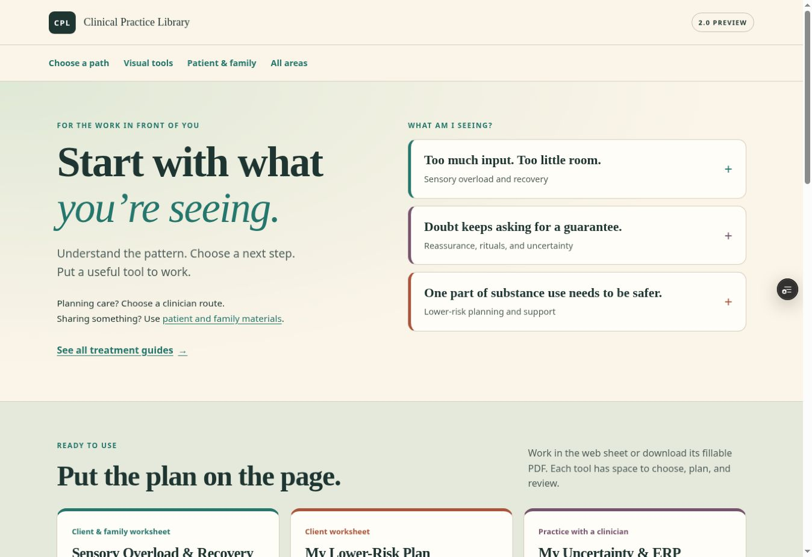
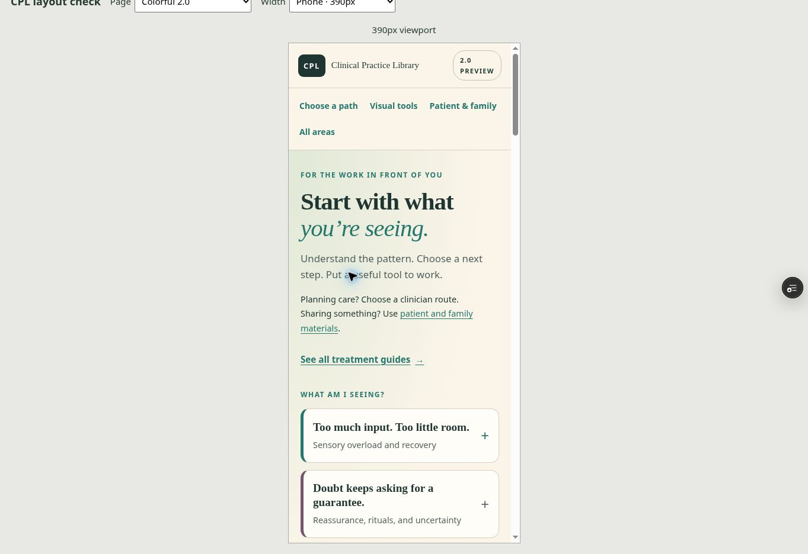

# Colorful 2.0 navigation checkpoint — October 4, 2026

## Result

The 2.0 starting page now supports the intended sequence: **What am I seeing? → Understanding → What should I do? → What tool? → What should I watch next?**

Three clinician routes connect sensory overload and recovery, uncertainty/ERP, and lower-risk planning to existing guides, usable web worksheets, and review prompts. The worksheets are shown first in the tool section. A separate patient/family section contains materials to read or share. Communication links lead directly to the relevant toolkit sections rather than an inert demonstration.

- [Reviewed 2.0 preview](https://clinical-practice-library-en7r1xvk8-cohon-family.vercel.app/preview/cpl2)
- [Draft PR #3](https://github.com/SophiaKorb/clinical-practice-library/pull/3), targeting `cpl-2-colorful-helpful`
- Candidate branch: `cpl2/navigation-tools-2026-10-04`
- Reviewed application commit: `3edc306ca9cc1155507f853e5c1d1c0d6f61611a`
- READY preview deployment: `dpl_7LDgDEy5oGu7C6SPxCE6w4YEh1fP` (preview target; no production promotion)

## Separation from stable production

The candidate was created from colorful commit `b441610d5656929602477c0e57984ff95ea5e328`. Its three application commits descend from that base. The colorful base branch has not been moved by this task.

At the final branch/deployment check, `main` remained at `27035be6f1b1466a1dbf28dc9c3f3d84b9666734`, and production remained the READY stable deployment `dpl_Ev6bMAEwep5N15ucyodBFavVNLCt`. The stable release was approved and published earlier. This draft is a separate 2.0 review; it is not production approval.

## Changes

- Replaced the broad 2.0 task cards with three native expandable clinical routes. Each has a guide, next action, working tool, review link, and a specific source or boundary where needed.
- Retained the cream, teal, plum, and terracotta palette with readable type, visible keyboard focus, and reduced-motion support. Added a skip link and 44px page-navigation targets.
- Added return links from the three featured worksheets to their matching open 2.0 route. Added review fragments with space below the sticky resource header.
- Repaired the clinician starting page: all 12 topics retain their order, visible shelf prefixes are removed, and 24 links open the existing treatment guides and practical toolkits. Patient/family materials have a distinct starting point.
- Made root-library fragments open the requested shelf, including its ancestor disclosures. The legacy `/resources` and `/resources/index` aliases redirect to the canonical root while preserving fragments.
- Fixed a clipped long clinician title found during the actual 320px guide flow. Resource headings now fit phones, and resource/worksheet actions have targets at least 44px high.
- Linked the OCD clinician companion to the actual IOCDF guide and named its source author. Removed duplicate footer credits from that companion and the two reading guides used here.
- Fixed the tools-index favicon destination and added branch-scoped navigation CI.

## Browser verification

The user story verified was: **choose what you are seeing, read a relevant clinician guide, use a practical worksheet, review it, and return to the matching 2.0 route; or choose a clearly labeled patient/family material to share.**

The same-origin viewport checker exercises actual CSS layout. It does not emulate phone hardware, an operating system, or a touch keyboard.

| 2.0 viewport | Document client width | Document scroll width | Open routes | Result |
| --- | ---: | ---: | ---: | --- |
| 320px | 305px | 305px | 3 | No horizontal overflow |
| 390px | 375px | 375px | 3 | No horizontal overflow |
| 768px | 753px | 753px | 3 | No horizontal overflow |
| 1280px | 1265px | 1265px | 3 | No horizontal overflow; three tool columns |

The 15px difference is the scrollbar. No heading, link, or route summary extended outside the document width.

Actual interactions verified:

- Enter opened native route disclosures. All three worksheet return links reopened the correct route on arrival.
- The sensory route opened the neurodevelopmental guide. Its title initially caused a 365px document at a 305px client width; after the repair, both were 305px and the full title was readable.
- The uncertainty route opened the OCD clinician companion with its explicit source link and the matching client worksheet. The lower-risk route opened its clinician guide. These guide layouts fit 320px.
- Each featured worksheet accepted a disposable preview entry and selection, then cleared both with the native reset action. The final download, reset, and return controls measured 44px high on all three worksheets at 320px.
- Review links landed below the sticky header: approximately 90px from the viewport top, with the header ending near 82px.
- The clinician entry fit 320px, exposed 12 topics and 24 guide/tool links, had no numbered topic prefixes, and displayed one author credit.
- The patient/family lower-risk reading link opened the reading guide. Its legacy library return reached the canonical root. A worksheet library return opened the patient/family shelf.
- `/resources/index#parent-patient` resolved to `/#parent-patient`, preserved the fragment, opened the shelf, and placed it near 88px from the viewport top.
- “Make a choice” reached the communication toolkit's `#choice` section.

## Download and print verification

All three featured PDF assets are unchanged from the colorful base. The live downloads matched repository SHA-256 hashes exactly:

| Tool | PDF pages | Canonical form fields | Page widgets | SHA-256 |
| --- | ---: | ---: | ---: | --- |
| Sensory Overload & Recovery Plan | 2 | 29 | 32 | `631b6219e43d039fb6e25e575dfe6d78055a50acdf0468a34379eca4bc5e5912` |
| My Lower-Risk Plan | 2 | 30 | 30 | `fc0c6f547c00f4c4dd80703c0e04952beb449e92a3214b0fe035ceb121e2fcdb` |
| My Uncertainty & ERP Practice | 2 | 20 | 20 | `fe22a8063bb6c06a71f8e68edc63cfdd970954cb9ef2f870bbbf55e1bc7b2ffa` |

All fields were blank. Sensory has a radio group with four widgets, explaining its field/widget count difference. All six PDF pages were rendered and visually reviewed: no clipped text, overlaps, or broken diagrams were found.

Worksheet print rules hide the newly added navigation controls. The 2.0 page opens its native disclosures before printing and restores their previous state afterward. **Native HTML print export remains unverified:** clicking the worksheet print control did not expose a printable document or usable print dialog in this browser. Downloadable PDF output was reviewed; do not equate that with a verified browser HTML print export.

## Checks

- `python scripts/check-library-links.py`: PASS — 253 HTML pages, 1,572 local destinations/assets, valid fragments and unique IDs.
- `node scripts/check-school-guide-parity.js --self-test`: PASS — eight guides, 292 paired supports, nine invalid cases rejected.
- `node --check preview/cpl2.js` and `node --check navigation.js`: PASS.
- `git diff --check`: PASS.
- GitHub “CPL 2.0 navigation QA” on the reviewed application commit: [success](https://github.com/SophiaKorb/clinical-practice-library/actions/runs/37211736300).
- Vercel commit status: success; preview deployment READY.
- No downloadable PDF, school content, research catalog, or stable production source was changed.

Source guidance for the new route summaries was checked October 4, 2026 at the [National Autistic Society](https://www.autism.org.uk/advice-and-guidance/behaviour/meltdowns/all-audiences), [IOCDF](https://iocdf.org/about-ocd/ocd-treatment-guide/exposure-response-prevention/), and [CDC](https://www.cdc.gov/stop-overdose/caring/polysubstance-use.html). Existing worksheet sources and original authorship remain visible. These navigation routes are not validated assessments or new treatment protocols.

## Remaining 2.0 work

1. Continue the visual and authorship/source audit of remaining clinician and patient resources, including duplicate footer credits and thin domain starting pages.
2. Review Grief Map, Personal Care Plan, and After-School Reset as separate 2.0 conversions. The stable conversions are already published on `main`; the colorful versions still have no native forms. They were not automatically imported into this track.
3. Check native HTML print output in a browser with a usable print/export UI before treating that path as verified.
4. Continue the established P0/P1 asset/Spanish-path review, keeping Spanish validation metadata explicit.

P1.5 remains deferred. The capped 95-record research core is unchanged. No production release is blocked by this draft, and no permission request is pending.
