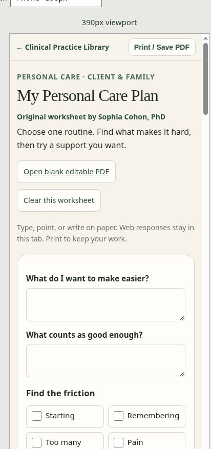

# October 4, 2026 — stable production release

The user approved publishing the reviewed stable candidate. [PR #2](https://github.com/SophiaKorb/clinical-practice-library/pull/2) was marked ready and merged into `main` with an expected-head guard; no new application changes were added during release.

## Release identifiers

- Reviewed PR head: `0653556f3d975190e2a669fa399cc7adf3042ef8`.
- Production merge commit: `27035be6f1b1466a1dbf28dc9c3f3d84b9666734`.
- Reviewed and merged tree: `da6691eb186640847418e06d3a6ce115dd44c33c`; a local comparison confirms no file differences between the candidate and merged application.
- Vercel production deployment: `dpl_Ev6bMAEwep5N15ucyodBFavVNLCt`, **READY**, target `production`, alias `clinical-practice-library.vercel.app`, with no alias error.
- [Live library](https://clinical-practice-library.vercel.app/).
- Colorful `cpl-2-colorful-helpful` remains at `b441610d5656929602477c0e57984ff95ea5e328`.

The GitHub Library links and navigation workflow and Vercel checks passed before merge. The earlier [candidate checkpoint](2026-10-04-STABLE-P0-P1-HANDOFF.md) records the full source, PDF, mobile, link, and school-guide verification. Its pre-release approval boundary is now historical; this record establishes the approved production outcome.

## Production smoke checks

- Homepage and all three newly converted worksheets fit a **320px CSS viewport** without horizontal overflow: client and scroll widths are both 305px, allowing for the browser scrollbar.
- Grief, Care, and Reset choice labels meet or exceed **44px** after styles finish loading. Each worksheet has one author byline and the expected 38, 41, or 37 web controls.
- Personal Care Plan also fits **390px**, with client/scroll width 375px and choice labels at least 44px high. A synthetic entry and checkbox were cleared successfully; no test responses remain.
- All three PDFs downloaded from the public production pages. SHA-256 comparisons confirm each download is byte-for-byte identical to its reviewed repository PDF. All are two pages with blank defaults: 38 Grief fields, 41 Care fields, and 37 Reset fields.
- `/resources/#parent-patient` redirects to `/#parent-patient`, preserves the fragment, opens the intended shelf, and positions it below the header.
- The live clinician route has **12 topics and 24 guide/tool links** and presents the intended five-step sequence. A topic's toolkit link opens the correct page; its return link reaches the canonical homepage.
- Vercel deployment metadata confirms the public production alias serves the approved `main` merge commit.

## Remaining work

The native browser HTML Print / Save PDF dialog remains unavailable in the review environment; that specific spot check is still outstanding. The downloadable printable PDFs have been verified. Remaining legacy visual/printable conversions and Spanish/source/rights checks are unchanged from the candidate checkpoint. P1.5 and colorful 2.0 remain separate.

This release record and screenshot are saved on `stable/release-verification-2026-10-04`; they add no further production application changes.
