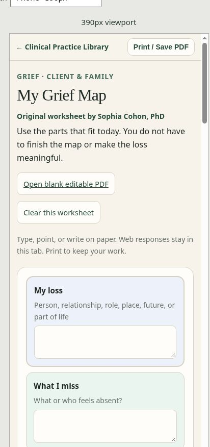

# October 4, 2026 — stable P0/P1 checkpoint

## Review candidate and release boundary

[Draft PR #2](https://github.com/SophiaKorb/clinical-practice-library/pull/2) targets `main` from `stable/p0-p1-completion-2026-10-04`.

[Reviewed preview](https://clinical-practice-library-cfulr5tuf-cohon-family.vercel.app/preview/layout-check) is READY and contains the complete application changes at `f9b7844bc6650953977452c69fa9ad89c0c93b6d`. The final checkpoint commit adds documentation and a screenshot only. Preview access retains the project's existing protection.

Production remains READY at `6959cbebf780f75a51cdb5f74b75b582609fa03b`, deployment `dpl_Ab8MPywPQhmbHNRc7UpfxmXkQY5W`. The colorful `cpl-2-colorful-helpful` branch remains at `b441610d5656929602477c0e57984ff95ea5e328`. Neither branch was modified or promoted during this work. Explicit approval is required before publishing this candidate to production. P1.5 remains deferred.

## What the inspection established

The September 29 and September 30 checkpoints match the current production files. Earlier homepage and communication-toolkit phone fixes were already deployed. The sensory, lower-risk, and ERP worksheets already had native web controls and blank two-page editable PDFs.

Grief Map and Personal Care Plan had visual web layouts but older linear PDF forms. After-School Reset had a visual web page without a matching editable PDF. These three conversions are now complete on the draft branch.

There were no open repository issues or PRs returned by the initial outstanding-work search. The repository checkpoints were the useful work queue.

## Navigation and presentation

- Resource return links now use the canonical root homepage. Vercel redirects `/resources` and `/resources/index` there; the small fallback page preserves query strings and fragments. A live `/resources/#parent-patient` visit preserved the fragment, opened the shelf, and placed its introduction below the sticky header.
- `navigation.js` opens the details elements containing a fragment target, including incoming links from another page. Modified clicks retain their normal browser behavior.
- The primary homepage action is **Start with a need**. Common needs use observable language, with reading guides, useful tools, and distinct clinician links. Sensory overload and after-school recovery have direct entries.
- Therapy Resource Shelves now follows **What am I seeing? → Understanding → What should I do? → What tool? → What should I watch next?** Twelve topics retain their existing order. Twenty-four guide/tool links replace the former list of names. Decorative numbering is removed; resource URLs remain intact.
- Patient/family materials and clinician resources retain explicit audience labels. Assessment reference remains a separate specialist entry.
- Duplicate footer author names were removed from 124 pages that already had a named byline. Source authorship, evidence limitations, and rights notes remain. The catalog favicon path was corrected.

## Three completed worksheets

Each worksheet has a client/family working page and a clinician/supporter planning-and-review page. Web responses remain in the current tab; native reset clears text and choices. Matching public PDFs are blank, editable, and use the same control names as their web pages.

| Worksheet | Visual structure | PDF fields/widgets | Pages | Download |
| --- | --- | ---: | ---: | --- |
| My Grief Map | Loss surrounded by what is missed, what changes, what remains, and support | 38 | 2 | [Existing filename retained](../../resources/downloads/my-grief-map-fillable.pdf) |
| My Personal Care Plan | First → Then → Next → Done, friction-to-support choices, autonomy | 41 | 2 | [Existing filename retained](../../resources/downloads/my-personal-care-plan-fillable.pdf) |
| My After-School Reset Plan | Arrive → Land → Reset → Ready, signals and chosen supports | 37 | 2 | [New matching download](../../resources/downloads/my-after-school-reset-plan.pdf) |

PDF body fonts and editable-field fonts are embedded. This fixes uneven spacing observed when standard Helvetica was substituted during rendering. Synthetic filled copies preserve values and appearances on both pages; these test copies are kept outside the repository. Public PDFs contain no sample responses.

## Authorship and source checks

New worksheet notes identify the materials as original planning tools by Sophia Cohon, PhD, not validated assessments or reproduced outside worksheets. One visible author credit remains per worksheet. General source guidance supports the planning directions; it does not validate the original diagrams, wording, or fields.

The following primary guidance was opened and checked during this batch. New worksheet notes record October 3, 2026, the local date of the source review.

| Area | Primary sources checked | Result |
| --- | --- | --- |
| Grief | [NHS grief and loss](https://www.nhs.uk/mental-health/feelings-symptoms-behaviours/feelings-and-symptoms/grief-bereavement-loss/) | Current source supports general grief education; no fixed-stage or validation claim added. |
| Sensory access and recovery | [National Autistic Society sensory processing](https://www.autism.org.uk/advice-and-guidance/about-autism/sensory-processing), [responding to meltdowns](https://www.autism.org.uk/advice-and-guidance/behaviour/meltdowns/all-audiences) | Linked as general guidance for choice, sensory access, reduced load, and recovery. The after-school and care routes are original applications. |
| ERP and uncertainty | [IOCDF ERP overview](https://iocdf.org/about-ocd/treatment/erp/), [ERP treatment guide](https://iocdf.org/about-ocd/ocd-treatment-guide/exposure-response-prevention/) | The changed clinician companion replaces its broad unlinked evidence paragraph with these specific sources and a direct client worksheet link. |
| Lower-risk planning | [CDC overdose response](https://www.cdc.gov/stop-overdose/response/index.html), [fentanyl facts](https://www.cdc.gov/stop-overdose/caring/fentanyl-facts.html), [polysubstance use](https://www.cdc.gov/stop-overdose/caring/polysubstance-use.html) | Existing core tool checked against current primary guidance; no new protocol or licensed content introduced. |
| Withdrawal and overdose scope | [ASAM benzodiazepine guidance](https://www.asam.org/quality-care/clinical-guidelines/benzodiazepine-tapering), [ASAM alcohol withdrawal guidance](https://www.asam.org/quality-care/clinical-guidelines/alcohol-withdrawal-management-guideline), [SAMHSA toolkit at CDC](https://www.cdc.gov/overdose-prevention/media/pdfs/2024/04/SAMHSA-overdose-prevention-response-toolkit.pdf) | General scope checked; the existing lower-risk worksheet remains a planning aid. |

NICE CG31 could not be independently retrieved in this environment. Do not mark it reverified. The changed OCD companion uses the IOCDF sources actually checked. Broader source, licensing, and Spanish validation review remains unfinished across the rest of the catalog.

## Verification evidence

- `python scripts/check-library-links.py`: **252 HTML pages; 1,258 local links/assets**, valid paths/fragments and unique IDs. Legacy root aliases are handled explicitly.
- `node scripts/check-school-guide-parity.js --self-test`: **8 guides, 292 paired supports**, and **9 invalid regression cases** rejected.
- `node --check navigation.js`, `node --check resources/visual-tools.js`, and `git diff --check`: pass.
- `scripts/check-stable-worksheets.py`: **116 blank fields/widgets** match their web control names; two pages per PDF, valid bounds and appearances, one author credit, synthetic filled values round-trip on both pages.
- All **six new PDF pages** rendered and visually reviewed, including corrected typed-field spacing. The three existing core PDFs remain blank and two pages each.
- GitHub **Library links and navigation** workflow completed successfully for the application commit. It runs the link checker, navigation syntax check, and existing school-guide parity self-test.
- Live **need → Grief Map → PDF**, **treatment topic → guide**, **treatment topic → toolkit**, and **resource → canonical homepage** routes verified after navigation completed.
- Native input and reset verified on all three new web forms using synthetic text and one checkbox. No worksheet responses were uploaded or committed.

| Page group | CSS viewport widths | Document scroll widths | Result |
| --- | --- | --- | --- |
| Stable homepage | 320, 390, 1280px | 305, 375, 1265px | No horizontal overflow |
| Therapy Resource Shelves | 320, 390px | 305, 375px | 12 topic cards; 24 links; links at least 44px high |
| All six current visual worksheets | 320, 390px | 305, 375px | No horizontal overflow; one author byline; phone choices at least 44px high after styles load |

The 15px difference is the browser scrollbar. These are real deployed pages in a same-origin viewport iframe, testing CSS layout rather than a specific phone operating system or touch device. The maintainer checker is not linked from the public browsing navigation.



The native browser print dialog is not exposed by this review environment. The Print / Save PDF button was invoked, but no native export UI was available to inspect. Downloadable printable output is verified. A normal-browser HTML print spot check remains before production approval, especially with longer typed answers; such answers can increase the page count.

## Regenerate and verify

The three new forms share content in `data/stable-worksheets.json`. The generator produces both HTML and PDFs using Python, ReportLab, pypdf, and ReportLab's bundled Vera fonts. It does not require browser automation. After regeneration, render both pages of every changed PDF and inspect blank and synthetic-filled output.

```sh
python scripts/build-stable-worksheets.py
python scripts/check-library-links.py
python scripts/check-stable-worksheets.py
node scripts/check-school-guide-parity.js --self-test
```

For optional synthetic round trips, pass `--samples` with a scratch directory outside the repository. Dependencies must be available in the chosen Python environment.

## Remaining P1 and blockers

1. Spot-check the HTML Print / Save PDF flow in a normal browser before approving production. The downloadable PDFs are ready; the blocker is this environment's unavailable native print UI.
2. Continue matching visual/editable web and PDF work for the remaining legacy tools, beginning with Task Launch Map, Grounding Menu, and Safety Planning Preparation Sheet. Their existing working URLs remain.
3. Consider a useful standalone print set for the 17 Communication Supports Toolkit visuals; its earlier phone fix is already complete.
4. Continue catalog-wide source/authorship/rights checks and the Spanish duplicate/asset-path and validation-metadata review. Do not imply the English conversions update the Spanish materials. Revisit NICE CG31 through a working authoritative source.

P1.5, colorful 2.0 design changes, new research-core additions, and unapproved production publishing remain outside this batch.
